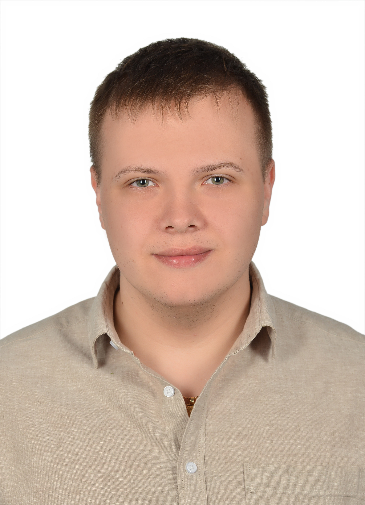

# Kacper Frelek  
🚀 **Aerospace Engineer | CFD Enthusiast | Aeromechanic Engineer**

I'm a **Junior Aeromechanical Engineer** at the **Warsaw Institute of Aviation (EDC)**, specializing in **aeromechanical analysis** using tools such as **GageMap, ANSYS, and NX**.  
I have experience in **aerospace engineering, computational aerodynamics, and optimization**, and I thrive in international, collaborative environments.  

🔬 Focused on **aeromechanics, numerical simulations, spacecraft design, and aerodynamic optimization**.  
📚 Currently pursuing my **Master's in Aerospace Engineering** at the **Warsaw University of Technology**.

---

## **Experience**
### **Junior Aeromechanic Engineer**  
**Warsaw Institute of Aviation (EDC) | 06/2023 – Present**  
- Conducting **aeromechanical analyses** using **GageMap and ANSYS**.  
- Interpreting results and participating in **test campaigns**.  
- Preparing **certification documentation** and working in international teams.  

### **Analysis Team Member**  
**Students' Space Association - Rocketry Division | 02/2022 – 05/2024**  
- Performed **CFD simulations** on various rocket components.  
- Focused on **aerodynamic performance and design optimization**.  
- Worked on **FOK Rocket (split canards) and GROT Rocket (nose cone & fins)**.  

### **Engineering Apprentice**  
**The Space Research Centre of the Polish Academy of Sciences | 07/2022 – 08/2022**  
- Conducted **research for testing procedures**.  
- Modeled aerospace components in **NX** and prepared **engineering drawings**.  
- Participated in **thermal vacuum test setups**.  

---

## **Education**
🎓 **Master’s in Aerospace Engineering** *(02/2024 – Present)*  
📍 Warsaw University of Technology  

🎓 **Bachelor of Aerospace Engineering** *(10/2020 – 02/2024)*  
📍 Warsaw University of Technology  
**Thesis:** *Aerodynamic Performance Analysis of Falcon 9 Grid Fins: CFD*  
- Evaluated **reentry control surfaces** across all **Mach regimes**.  
- Conducted **mesh sensitivity studies**, **CAD modeling**, and **CFD simulations**.  
- Analyzed aerodynamic behavior using **ANSYS Fluent & Post-processing tools**.  

---

## **Skills**
✔ **Computational Fluid Dynamics (CFD)** – ANSYS Fluent, CFX, OpenFOAM  
✔ **Aerodynamics** – Subsonic, Transonic, Supersonic, Hypersonic Flow  
✔ **Programming** – Python, MATLAB  
✔ **Engineering Software** – Siemens NX, HyperMesh, GageMap  
✔ **Simulation & Analysis** – Simulink, ANSYS Post  

---

## **Certifications**
📜 **3D Modeling & Drafting (NX)** – Siemens Industry Software  
📜 **Geometry, Mesh & Flow Analysis (ANSYS)** – Warsaw University of Technology  
📜 **Basics of Altair HyperMesh** – Endego, Altair Channel Partner  

---

## **Languages**
- **English:** C1 (Listening & Reading), B2 (Writing & Speaking)  
- **Polish:** Native  

---

## **Interests & Hobbies**
🏋️ **Bodybuilding & Fitness**  
💻 **Learning new software & coding**  
✈ **Experimental Aerodynamics & Space Exploration**  
🌍 **Traveling**  

---

## **Contact**
📧 **Email:** [kacperfrelek@gmail.com](mailto:kacperfrelek@gmail.com)  
🔗 **LinkedIn:** [linkedin.com/in/kacper-frelek-741545235](https://www.linkedin.com/in/kacper-frelek-741545235/)  
📄 **[View My CV](cv.html)**  

